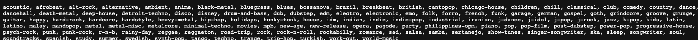

# A music recommendation service

## Usages
*run `make run` to make it deployed to localhost
*find the website working:http://localhost:8000   ->Hello
*get genres :http://localhost:8000/show_genres  ->genres
#get recommendations from http://localhost:8000/[genre]

## To push an image to DockerHub, follow these steps:
* `docker login` and enter your docker "user_name" and "user_secret" as prompted
* `docker build -t [NAME OF YOUR APP] .`
  * You could just run `make build` for this program
  * Build an image out of the Dockerfile:
  * `docker tag [NAME OF YOUR APP]:latest [YOUR DOCKER USER NAME]/[NAME OF YOUR APP]:latest`
  * `docker push [YOUR DOCKER USER NAME]/[NAME OF YOUR APP]:latest`
## Build and run your own docker container
  * run `make build`
  * run `make run-docker`
## Deploy to a minikube cluster with minikube ctl (command line tool) 
  * install minikube ctl. See [here](https://minikube.sigs.k8s.io/docs/start/)
  * start minikube service:
    * `minikube start`
    * make an alias
      * `alias kubectl="minikube kubectl --"`
    * download the appropriate version of kubectl and access your minikube cluster
      * `kubectl get po -A` (which runs `minikube kubectl -- get po -A`)
    * deploy applications
      * make sure you have pushed your docker image to DockerHub (find instructions [here](https://www.pluralsight.com/guides/create-docker-images-docker-hub))
      * create a deployment and expose it on port 8080 
        * `kubectl create deployment [NAME OF YOUR APP] --image=registry.hub.docker.com/mianwu/musicreco:latest`
        * `kubectl expose deployment [NAME OF YOUR APP] --type=NodePort --port=8000`
      * Get the deployment information
        * `kubectl get services [NAME OF YOUR APP]`
      * Let minikube launch a web browser (the terminal needs to be open to run it)
        * `minikube service [NAME OF YOUR APP]`
      * You could also use kubectl to forward the port from 8080 to local 7080
        * `kubectl port-forward service/[NAME OF YOUR APP] 7080:8080`
